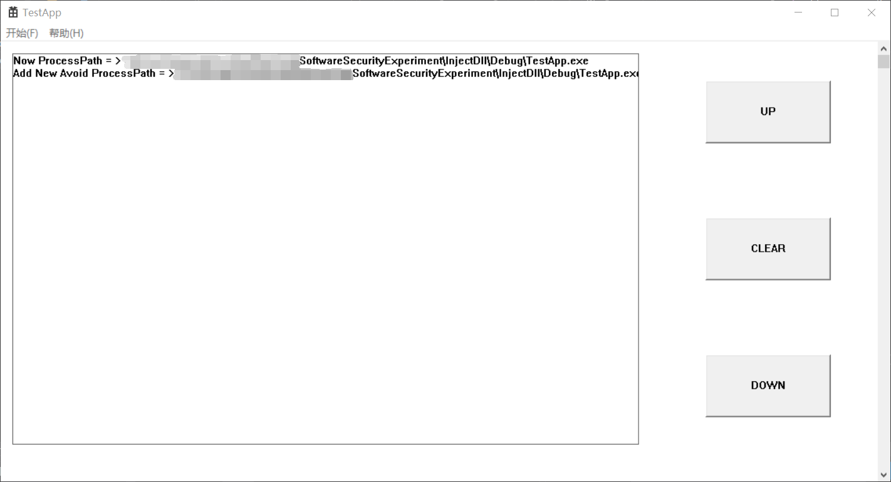
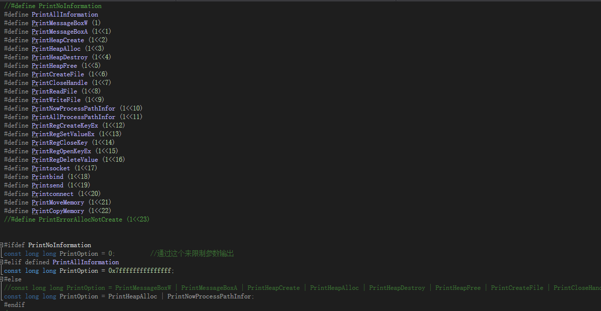
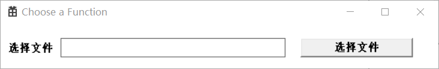
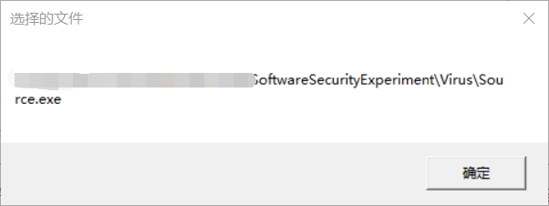
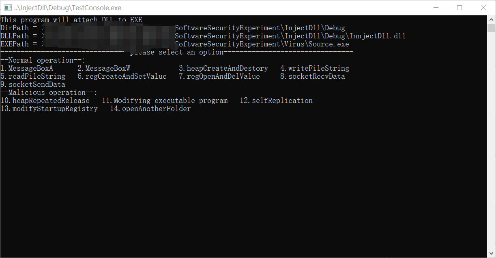
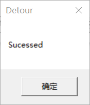
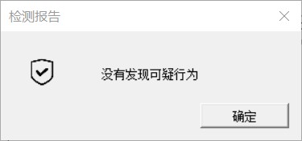

# InjectDll

[TOC]

基于API HOOK的软件行为分析系统
## 背景
本项目为华中科技大学网络空间安全学院2021年秋季学期软件安全课的课程实验。根据学院培养计划，大三时应带具有自主开发安全工具的能力，因此就有了这次的软件安全课程设计。主要目的是利用[Detours开源项目包](https://github.com/microsoft/Detours)提供的接口，完成无源码情况下对基本的程序行为分析，并且通过一个精(~~简~~)美(~~陋~~)的前端来进行控制，包括选择测试文件以及输出钩子信息以及分析结果。根据要求，本项目主要使用C或者C++在Windows平台完成。

更多的要求详见[任务书](https://github.com/AnthemK/InjectDll/blob/master/Documentation/%E8%BD%AF%E4%BB%B6%E5%AE%89%E5%85%A8%20%E8%AF%BE%E7%A8%8B%E8%AE%BE%E8%AE%A1%20%E5%AE%9E%E9%AA%8C%E6%8C%87%E5%AF%BC%E4%B9%A62021%EF%BC%88%E6%95%B4%E5%90%88%EF%BC%89v1.9.docx)

## 环境要求
本项目主要是作为学校要求的要实现一定功能的实验课作品。因此并没有实现快速安装等等的功能。主要是源代码供大家参考。下面说一下源代码编译运行需要的环境    
* 首先整个项目是运行在Windows平台上的32位程序，其分析的可执行程序也应该是32位应用程序。如果运行一个64位程序，则程序会去注入run32dll.exe。而此时会返回文字信息表示这不是一个32位的程序
* 程序完全使用的Unicode编码，因此Detour的函数全部都是XXXXW而非XXXXXA，如果测试程序所调用的API不是Unicode型的话，就无法实现Detour。
* 因为程序是基于[Detour开源项目包](https://github.com/microsoft/detours)完成的，因此肯定需要安装这个项目包。并且将其加入到包含目录和库目录以提供函数功能的支持。
* 需要在链接器中加入ws2_32.lib;附加依赖项，或者在链接命令行中加上  -lws2_32，以支持Detour一些网络通信函数的功能。
* 以上所有环境配置均需要在三个项目中全部配置。
* 因为一些神秘的不安全的函数，因此建议在编译注入的dll文件的时候，先关闭SDL检查。或者可以更改成安全的函数或者定义相应的宏。
* TestApp程序在运行的时候，需要预先生成出要加载的payload也就是dll文件以及注射器的可执行文件。并且位置在.\InjectDll\Debug里面。如果要修改可执行程序的位置，那么可能需要修改程序中的静态的相对位置。
* 本项目没有做过移植性测试，所以不能保证一定能成功编译运行

## 设计架构

其中TestApp，InjectDLL，Test Console分别为三个项目     
除此之外，我也借用了一些别人写的测试程序作为样本，存在Virus里面。source程序是一位学长写的大概是测试一些常用的行为能不能被钩上，话有一些常见的危险行为会不会被报警。client和server就是一个简单的测试网络行为用的。  

## 使用方法
完成编译之后可以直接打开TestApp程序开始运行，主界面如图所示：

右面有三个按钮和一个滑动条，来操控输出的信息，当前页的信息主要是钩子直接勾到的函数参数，所以数量会非常大。如果想要屏蔽某些钩子函数的参数输出的话，则可以通过修正dll文件里的输出过滤宏来实现

点击左上角开始界面之后，选择测试就可以进入选择文件界面。

选择一个合法的文件之后，会弹出一个窗口输出当前目录（~~实际上这是一个调试用的，但是我懒得删了~~）

点掉之后，就进入注射器界面，注射器本身是一个控制台程序，如果目标程序也是控制台的话，就会在同一个控制台程序里面，大概是这样

等到操作完目标程序之后，点掉就可以显示报警信息的界面。这个界面主要是提示程序运行中出现的危险行为，其中有些会被dll直接截断，有些则不会。如果没有错误，则会出现

