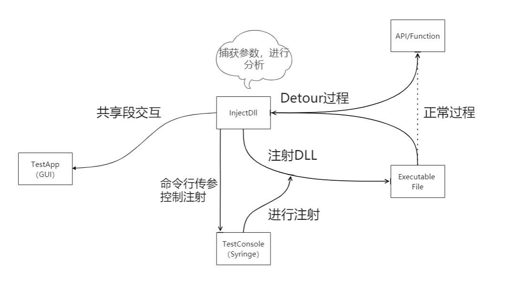

# InjectDll

[TOC]

基于API HOOK的软件行为分析系统
## 背景
本项目为华中科技大学网络空间安全学院2021年秋季学期软件安全课的课程实验。主要目的是利用Detours开源项目包提供的接口，完成无源码情况下对基本的程序行为分析，并且通过一个精(~~简~~)美(~~陋~~)的前端来进行控制，包括选择测试文件以及输出钩子信息以及分析结果。根据要求，本项目主要使用C或者C++在Windows平台完成。

更多的要求详见[任务书](https://github.com/AnthemK/InjectDll/blob/master/Documentation/%E8%BD%AF%E4%BB%B6%E5%AE%89%E5%85%A8%20%E8%AF%BE%E7%A8%8B%E8%AE%BE%E8%AE%A1%20%E5%AE%9E%E9%AA%8C%E6%8C%87%E5%AF%BC%E4%B9%A62021%EF%BC%88%E6%95%B4%E5%90%88%EF%BC%89v1.9.docx)

## 环境要求
本项目主要是作为学校要求的要实现一定功能的实验课作品。因此并没有实现快速安装等等的功能。主要是源代码供大家参考。下面说一下源代码编译运行需要的环境    
* 首先整个项目是运行在Windows平台上的32位程序，其分析的可执行程序也应该是32位应用程序。如果运行一个64位程序，则程序会去注入run32dll.exe。而此时会返回文字信息表示这不是一个32位的程序
* 程序完全使用的Unicode编码，因此Detour的函数全部都是XXXXW而非XXXXXA，如果测试程序所调用的API不是Unicode型的话，就无法实现Detour。
* 因为程序是基于[Detour开源项目包](https://github.com/microsoft/detours)完成的，因此肯定需要安装这个项目包。并且将其加入到包含目录和库目录以提供函数功能的支持。
* 需要在链接器中加入ws2_32.lib;附加依赖项以支持Detour一些网络通信函数的功能。
* 以上所有环境配置均需要在三个项目中全部配置。
* 因为一些神秘的不安全的函数，因此建议在编译注入的dll文件的时候，先关闭SDL检查。或者可以更改成安全的函数或者定义相应的宏。
* 本项目没有做过移植性测试，所以不能保证一定能成功编译运行

## 设计架构

其中TestApp，InjectDLL，Test Console分别为三个项目

## 

